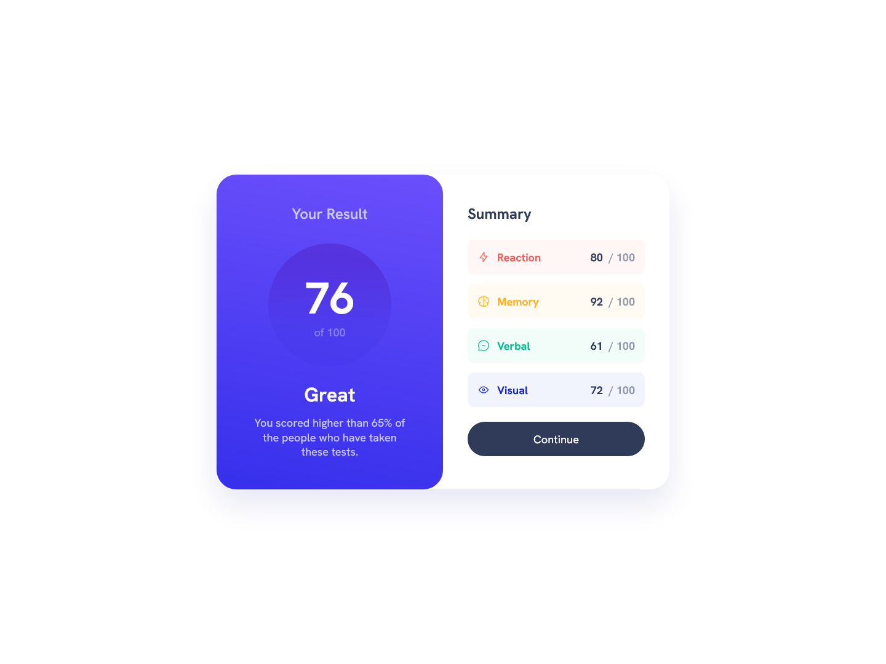
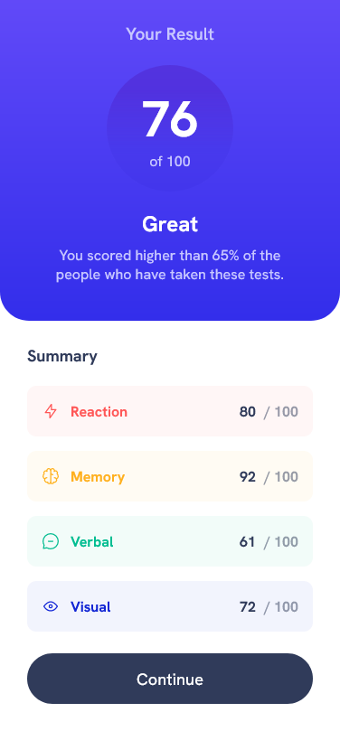

# Frontend Mentor - Results summary component solution

This is a solution to the [Results summary component challenge on Frontend Mentor](https://www.frontendmentor.io/challenges/results-summary-component-CE_K6s0maV). Frontend Mentor challenges help you improve your coding skills by building realistic projects.

## Table of contents

- [Overview](#overview)
  - [The challenge](#the-challenge)
  - [Screenshots](#screenshots)
  - [Links](#links)
- [My process](#my-process)
  - [Built with](#built-with)
  - [What I learned](#what-i-learned)
  - [Useful resources](#useful-resources)
- [Author](#author)

## Overview

### The challenge

Users should be able to:

- View the optimal layout for the interface depending on their device's screen size
- See hover and focus states for all interactive elements on the page
- **Bonus**: Use the local JSON data to dynamically populate the content

### Screenshots

### Links

- Live Site URL: [Github Pages](https://mehmeterogul.github.io/results-summary-component/)

## My process

### Built with

- CSS custom properties
- Flexbox
- Mobile-first workflow
- Dynamic content creation

### What I learned

I learned how to fetch data from a json file and dynamically create content with that data.

### Useful resources

- [How to FETCH data from an API using JavaScript ](https://www.youtube.com/watch?v=37vxWr0WgQk) - This helped me how to use fetch() function.
- [How to fetch data stored in a json file | Read with javascript local json file.](https://www.youtube.com/watch?v=o6bLYYStZss) - This helped me how to create content dynamically with a json file.

## Author

- Frontend Mentor - [@mehmeterogul](https://www.frontendmentor.io/profile/mehmeterogul)
- LinkedIn - [@mehmet-erogul](https://www.linkedin.com/in/mehmet-erogul)
- Twitter - [@MehmetErogul96](https://www.twitter.com/MehmetErogul96)
